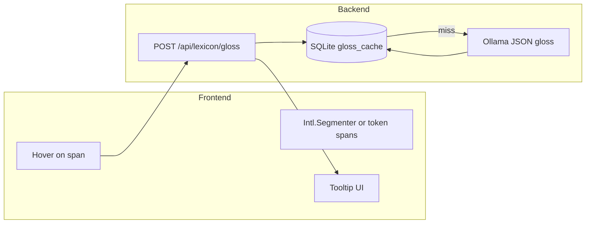

# Beginner vocabulary, interactive learning, research-backed roadmap, hover glosses

## Current baseline (repo)

- **Vocabulary** lives on [frontend/src/pages/SrsPage.tsx](frontend/src/pages/SrsPage.tsx): users type **front (L2)** and **back (L1)**; [backend/app/routers/srs.py](backend/app/routers/srs.py) persists [Card](backend/app/models.py) rows and schedules with **SM-2** in [backend/app/srs/sm2.py](backend/app/srs/sm2.py).
- **LLM integration** already exists: [ollama_generate_json](backend/app/services/ollama.py) (JSON mode) for exercises; [tutor_system_prompt](backend/app/services/ollama.py) uses `lang_target`, `lang_ui`, `cefr_level` from [Settings](backend/app/config.py). Public settings API exposes `lang_ui` at [GET /api/settings/public](backend/app/main.py) (frontend types today omit `lang_ui` but the field is available).
- **Target-language text surfaces**: chat bubbles ([ChatPage.tsx](frontend/src/pages/ChatPage.tsx)), voice transcript/reply ([VoicePage.tsx](frontend/src/pages/VoicePage.tsx) — not re-read but same pattern), exercise payloads ([ExercisePage.tsx](frontend/src/pages/ExercisePage.tsx)), SRS card **front**.

---

## 1. Evidence base (what the literature supports)

Use these as **design constraints**, not marketing claims:

| Mechanism                                     | Implication for the app                                                                                                                                                                                                                    | Representative evidence                                                                                                                                                                                                                                                                                                                                        |
| --------------------------------------------- | ------------------------------------------------------------------------------------------------------------------------------------------------------------------------------------------------------------------------------------------ | -------------------------------------------------------------------------------------------------------------------------------------------------------------------------------------------------------------------------------------------------------------------------------------------------------------------------------------------------------------- |
| **Distributed / spaced practice**             | Keep SRS; prioritize spacing over cramming                                                                                                                                                                                                 | SSLA work on distributed practice (e.g. optimizing distributed practice online, *Studies in Second Language Acquisition*); spacing effects summarized in modern reviews (e.g. *Nature Reviews Psychology* strand on spacing and retrieval).                                                                                                                    |
| **Retrieval practice + feedback**             | Interactive steps must **force recall** and then give **corrective feedback**                                                                                                                                                              | Meta-analytic support for testing effect in education; 2025 synthesis highlights **feedback** as a moderator when comparing retrieval to elaborative encoding (*Educational Psychology Review*). For L2 lexis, **retrieval combined with encoding strategies** can outperform encoding alone at delay (*Memory & Cognition* keyword + retrieval line of work). |
| **Comprehensible input + interaction**        | Content slightly above level; allow **negotiation** (clarify, repeat, simplify) in chat                                                                                                                                                    | Input and interaction effects are nuanced in experiments (e.g. comprehensible input and acquisition — *SSLA*); product-wise: tutor prompt already nudges CI; strengthen with **graded text** and **gloss-on-demand** (tooltips) so beginners are not blocked.                                                                                                  |
| **Multimodal binding**                        | Tie **audio** (TTS) and **meaning** to written form during learn phase                                                                                                                                                                     | Multimedia learning principles (Mayer) support words + images/audio where practical; pair with your existing TTS proxy ([/api/speech/tts](backend/app/routers/speech.py)).                                                                                                                                                                                     |
| **Cutting-edge scheduling (memory models)**   | Optional later upgrade from SM-2 to **FSRS**-style personalized intervals                                                                                                                                                                  | FSRS (open-spaced-repetition) uses fitted forgetting curves; stronger fit than one-size SM-2 for heterogeneous items — plan as **phase 2** to avoid blocking the beginner UX work.                                                                                                                                                                             |
| **“Intelligence agent” / intensive programs** | Not a single peer-reviewed “spy method,” but **common training patterns** map cleanly: **task-based scenarios**, **high time-on-task**, **phased objectives** (survival → social → job-specific), **overlearning** of high-frequency forms | Treat as **product scaffolding** (learning paths, scenario library), cited qualitatively alongside SLA sources above.                                                                                                                                                                                                                                          |

**From zero knowledge:** combine **high-frequency, concrete, scripted input** (narrow topics), **massive receptive exposure with glosses**, **forced output with feedback**, and **spaced retrieval** — not input-only passive reading.

---

## 2. Feature A — LLM-preloaded vocabulary (no user-authored L2)

**Backend**

- Add an endpoint, e.g. `POST /api/vocab/generate-pack` (or under `/api/srs/…`), body: `{ theme?: string, count: number, model_tier?: ... }`.
- System/user prompts use **only** [Settings](backend/app/config.py): `lang_target`, `lang_ui`, `cefr_level` (and optional theme). Instruct the model to output **strict JSON**: list of `{ lemma, gloss_native, example_l2, hint_native? }` via existing [ollama_generate_json](backend/app/services/ollama.py).
- **Validation**: reject empty strings; cap `count` (e.g. ≤ 30); optional schema check with Pydantic.
- **Persist**: for each item, `POST` logic equivalent to [create_card](backend/app/routers/srs.py) with `front = lemma` (or `lemma` + example as separate card type — see below), `back = gloss_native`, `hint = hint_native`, `source = "llm_pack"` (column already exists on [Card](backend/app/models.py)).
- **Idempotency / UX**: optional `pack_id` or “replace my LLM starter deck” by tagging cards with `source` and deleting prior `llm_pack` rows for default deck — product decision in implementation.

**Frontend** ([SrsPage.tsx](frontend/src/pages/SrsPage.tsx))

- Replace (or demote) free-text L2/L1 inputs with: **theme** (optional), **number of words**, **Generate deck** button, loading/error states.
- Keep **advanced** “Add card manually” collapsed for power users who *can* type L2.

**Card shape decision (recommended)**

- **Recognition-first for absolute beginners:** `front` = **L2 lemma or short phrase**; `back` = **L1 gloss**; store full **example sentence** in `hint` or new optional column — if you avoid schema migration initially, concatenate example into `hint` with a light delimiter the UI can parse, or add `example_l2` / `example_translation` columns in a follow-up migration for cleaner rendering.

---

## 3. Feature B — Interactive vocabulary learning (not only flip + SM-2)

Keep SM-2 for **review**, but add a **Learn** phase for `repetitions == 0` (or explicit `card_state`) so the app feels like a product, not a flashcard DB.

**Pedagogy-aligned interactions (MVP set)**

1. **Presentation:** show L2 + play TTS ([existing client pattern](frontend/src/pages/ChatPage.tsx)) + optional short L1 gloss (read-only once).
2. **Cued recall:** multiple-choice **L2 → pick correct L1** (distractors from other cards in the same batch or LLM-generated JSON for the pack).
3. **Production:** show L1 (or picture/description later) → user **types** L2; grade with **fuzzy match** first; optional `POST /api/vocab/grade-production` using small LLM JSON for “acceptable variants” when fuzzy fails.
4. **Feedback:** always show correct answer + **brief** explanation in `lang_ui` on wrong attempts (retrieval + feedback literature).

**Backend**

- New lightweight routes, e.g. `POST /api/vocab/quiz/multiple-choice` (generate 4 options for `card_id`) or precompute distractors when pack is generated (cheaper at runtime).
- On successful completion of learn steps, either **mark card “graduated”** to normal SRS (set `repetitions` / `due_at` per a simple rule) or add a boolean `learned` — minimal change: after N correct interactions, call existing [schedule_review](backend/app/srs/sm2.py) with quality 4 once to seed the interval chain.

**Frontend**

- New section on SRS page or sub-route: **“Learn new (n)”** queue separate from **“Due reviews”**.

---

## 4. Feature C — Hover tooltips: L2 surface → L1 glosses app-wide

**Architecture**

**Backend**

- New table, e.g. `gloss_cache`: normalized key `(lang_pair, surface_lower)` or include **sentence hash** for disambiguation on homographs; store JSON result `{ glosses: string[], pos?: string }`.
- `POST /api/lexicon/gloss` with `{ surface, sentence?, lang_target, lang_ui }` — prefer **settings defaults** from server to avoid client spoofing, but allow `sentence` for context-aware disambiguation.
- Use **fast** model tier when available (`llm_model_fast`) to keep hover snappy; debounce on client (300–500 ms).

**Frontend**

- Reusable component, e.g. `TargetLangText`, used anywhere assistant/user content shows **target language**:
  - [ChatPage.tsx](frontend/src/pages/ChatPage.tsx) tutor bubbles (and optionally user if they practice in L2)
  - [SrsPage.tsx](frontend/src/pages/SrsPage.tsx) card **front**
  - Voice page reply text; exercise rendering once exercises display human-readable fields instead of raw JSON
- **Word boundaries:** use `Intl.Segmenter` where available; **locale** derived from a new env (e.g. `LANG_TARGET_LOCALE=es`) or parsed from `TTS_VOICE_TARGET` (e.g. `es_ES-...` → `es-ES`). CJK may need segmenter granularity = **word**; fallback: character bigrams or LLM sentence-level gloss list batched when a message completes (optimization path).

**Accessibility / mobile:** mirror hover with **long-press** or **tap-to-gloss** for touch devices.

---

## 5. Research-driven roadmap (additional features, phased)

**Phase 1 (with A–C)** — highest leverage for “from zero”

- **Graded reader mode:** LLM generates 1 short text at `cefr_level`, plus inline optional gloss list; user reads with hover support.
- **Session template:** “Warm-up reviews → learn new → chat task → 1 exercise” (your existing plan doc already sketched this; wire as a **guided session** page or checklist).

**Phase 2**

- **Narrow reading:** generate 3–5 texts on the same **narrow theme** to recycle vocabulary (thematic clustering).
- **Interleaved session:** mix SRS + dictation + shadowing in one timed block (modality interleaving — implement conservatively; evidence is mixed by domain, but variety aids engagement).
- **FSRS or FSRS-lite:** replace or complement SM-2 using open-spaced-repetition libraries; requires logging per-review ratings consistently.

**Phase 3**

- **Pronunciation + lexical bundles:** collocations / phrases as SRS cards (usage-based SLA angle).
- **Analytics:** time-on-task, retention proxies (lapse rates) to tune `cefr_level` automatically via tutor prompt.

---

## 6. Files likely touched (implementation order)

1. [backend/app/models.py](backend/app/models.py) + migration/init: `gloss_cache` (and optional `example_l2` on `cards` if you split lemma vs example cleanly).
2. New [backend/app/routers/lexicon.py](backend/app/routers/lexicon.py) (gloss) + [backend/app/routers/vocab.py](backend/app/routers/vocab.py) (pack + optional grade) — register in [main.py](backend/app/main.py).
3. [backend/app/services/ollama.py](backend/app/services/ollama.py): small prompt helpers for pack JSON and gloss JSON (reuse `format: json`).
4. [frontend/src/components/TargetLangText.tsx](frontend/src/components/TargetLangText.tsx) (new) + wire into pages.
5. [frontend/src/pages/SrsPage.tsx](frontend/src/pages/SrsPage.tsx): generate pack UI + learn-mode UI.
6. [frontend/src/api.ts](frontend/src/api.ts): `gloss` + `generatePack` helpers.
7. [.env.example](.env.example): `LANG_TARGET_LOCALE` (if not inferring from voice key).

---

## 7. Risks and mitigations

- **LLM hallucinations on glosses:** cache + allow user “report wrong gloss”; prefer **short** JSON schema; optional second-pass validation prompt for high-stakes decks.
- **Latency on hover:** aggressive debounce + cache; skip LLM for known SRS **lemma** hits (join gloss_cache with user’s card fronts).
- **Segmentation quality:** locale must be correct; document limitation for languages with poor browser segmentation.

This plan keeps changes **focused** on beginner access (no L2 typing to start), **interactive retrieval** aligned with feedback research, and **pervasive scaffolding** (tooltips) compatible with comprehensible input, while reserving **FSRS** and richer paths for later phases.