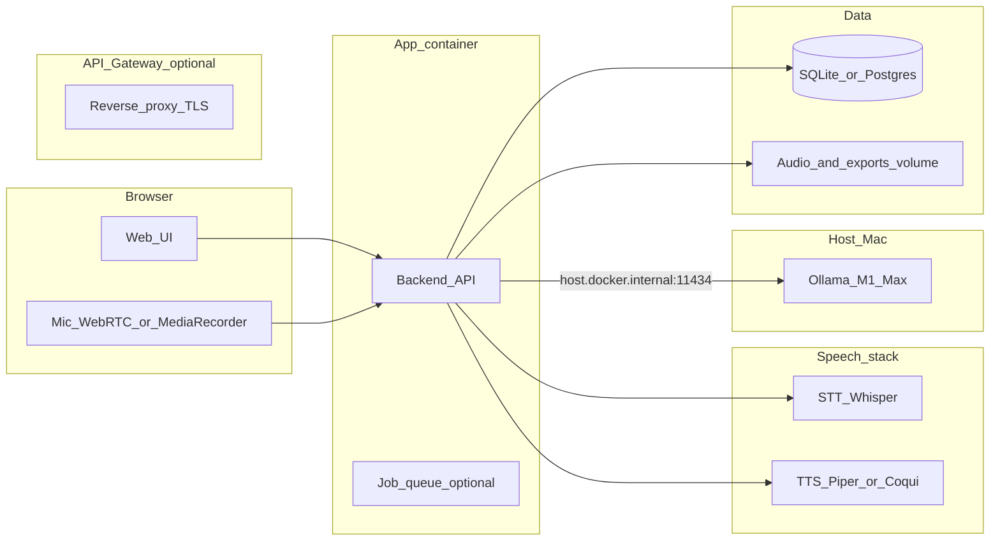

# Local LLM language learning system (Docker)

## Goals (from you + pedagogy)

**Your features:** speech recognition, accent-oriented feedback, spoken dialogue, writing practice, vocabulary drills, all runnable in Docker with clear compartmentalization.

**Techniques to fold in (from SLA / app design literature):** [comprehensible input](https://dev.to/pocket_linguist/the-science-of-language-learning-what-research-actually-says-1a93) (material slightly above current level), [spaced repetition](https://dev.to/pocket_linguist/the-science-of-language-learning-what-research-actually-says-1a93) for long-term retention, [shadowing](https://journals.sagepub.com/doi/full/10.1177/00336882221087508) (repeat audio while matching rhythm/intonation), **output practice** (speaking/writing to consolidate), **dictation** and **cloze** tasks for listening and form awareness, and **task-based** scenarios (order food, ask directions) so the LLM plays roles rather than only explaining grammar. Optional later: **narrow reading** (thematically linked texts) and **interleaving** (mix modalities in one session).

---

## High-level architecture

**Recommended default stack (fits empty repo, strong ML ecosystem):**

| Concern       | Default choice                                                                                                         | Rationale                                                                                             |
| ------------- | ---------------------------------------------------------------------------------------------------------------------- | ----------------------------------------------------------------------------------------------------- |
| Orchestration | `docker-compose.yml` + named volumes                                                                                   | Simple compartmentalization; one command up                                                           |
| Backend       | Python **FastAPI**                                                                                                     | Async, easy STT/TTS integration, good for streaming LLM responses                                     |
| Frontend      | **Vite + React** (or Svelte)                                                                                           | Mic access, SSE/WebSocket for streaming tutor replies                                                 |
| Local LLM     | **Ollama on the host** (your setup: M1 Max / 64 GB); Docker `app` uses `OLLAMA_HOST=http://host.docker.internal:11434` | Native Metal on macOS; avoids container GPU friction; swap models with `ollama pull` / `OLLAMA_MODEL` |
| STT           | **faster-whisper** or **whisper.cpp** in its own service                                                               | Offline; good accuracy; CPU/GPU profiles via compose overrides                                        |
| TTS           | **Piper** (light) or **Coqui XTTS** (heavier, more natural)                                                            | Fully local speech output for conversation and shadowing                                              |
| Data          | **SQLite** file on a volume (upgrade to Postgres if you add multi-user)                                                | Zero ops for solo use                                                                                 |

---

## Service boundaries (Docker + host)

1. `**app`** – FastAPI: auth (optional API key for LAN), session/orchestration, calls STT/TTS/LLM, serves static frontend in prod or proxies to dev server.
2. **Ollama (host, not in compose by default)** – Install and run the [Ollama macOS app](https://ollama.com); keep it listening on `127.0.0.1:11434`. From containers, set `OLLAMA_HOST=http://host.docker.internal:11434` (Docker Desktop provides `host.docker.internal`). Optional: bind Ollama only to localhost and rely on Docker’s bridge—do not expose `11434` on LAN without auth.
3. `**stt`** – HTTP service: POST audio (WAV/WebM) → JSON transcript + optional word timestamps (useful for alignment and “which syllable was unclear” heuristics).
4. `**tts`** – HTTP service: POST text + voice/lang → audio stream (for dialogue, prompts, shadowing source audio).
5. `**db` / volume** – Migrations for users (if any), decks, cards, review history, conversation logs (for spaced repetition and progress).

**Optional compose profile (Linux / non-Mac):** add an `ollama` service and set `OLLAMA_HOST=http://ollama:11434` when you want everything in containers (e.g. Linux + NVIDIA). This is **not** the default for your Mac workflow.

Use a **single Docker network** for app/STT/TTS; treat the host Ollama port as a controlled edge (localhost-only preferred).

---

## Host Ollama: M1 Max with 64 GB unified memory

Your machine can hold **much larger models** than typical 16–32 GB laptops and still leave room for macOS, Docker, and browser. Practical implications:

- **One “large” chat model at a time** (e.g. 30–70B-class quants) is feasible; expect **higher latency** than a 8–14B model—fine for writing exercises and planning, less ideal for tight voice back-and-forth unless you accept slower replies.
- **Voice loop (STT → LLM → TTS)** benefits from a **smaller, fast instruct model** so turns feel conversational.
- **Two-model strategy** (recommended): keep a **fast** model as default for dialogue, and switch (env var or UI) to a **stronger** model for lesson generation, grading, and nuanced explanations. Both are just different `ollama run` / API `model` names—no extra infrastructure.

### Suggested Ollama models (priorities for *language tutoring*)

Exact tags in the [Ollama library](https://ollama.com/library) change over time; treat names below as **starting points** and run `ollama pull` / compare sizes on your machine.

**A. Fast dialogue (low latency, good for daily speaking practice)**

- `**qwen2.5:7b`** or `**qwen2.5:14b`** – Strong **multilingual** coverage and instruction-following; 14B is a sweet spot on M1 Max for speed vs quality.
- `**llama3.1:8b`** – Very fast; excellent if your target language is well-represented in English-centric corpora; slightly less ideal than Qwen for some non-European targets.
- `**mistral-nemo:12b`** – Solid general instruct model; good alternative if you prefer Mistral’s style.

**B. Higher quality tutoring, exercises, and structured JSON (grading / cloze generation)**

- `**qwen2.5:32b`** – Often the **best single upgrade** on a 64 GB Mac for multilingual tutoring + reliable structured outputs without jumping to 70B.
- `**llama3.1:70b`** or `**llama3.3:70b`** (whichever is current in the library) in a **Q4_K_M** (or similar) quant – **fits in 64 GB** for many workloads but is **heavier**; use when you want maximum explanation quality, not for the fastest voice loop.
- `**gemma2:27b`** – Reasonable middle ground; good if you already like Gemma for your target language.

**C. If your target language is “high-resource” (e.g. Spanish, French, German, Japanese)**

- Start with `**qwen2.5:14b`** for voice + `**qwen2.5:32b`** for “homework” and grading. Adjust down if latency bothers you, or up to 70B-class if you want richer metalanguage explanations.

**D. If your target language is lower-resource or you see hallucinated grammar**

- Prefer **Qwen 2.5** line over tiny models; consider **32B** as default for *both* chat and exercises until outputs stabilize, then reintroduce a smaller model for voice-only sessions.

**Operational tips**

- Set `**OLLAMA_NUM_PARALLEL=1`** (or low) when using large models to avoid RAM spikes from concurrent requests.
- Use `**keep_alive`** in Ollama API if you want a loaded model to stay resident between turns during a study session (trades RAM for cold-start latency).
- Revisit model choice per language: pull two candidates, run the same system prompt (tutor + JSON exercise), and keep the winner in `.env` as `LLM_MODEL_FAST` and `LLM_MODEL_STRONG`.

---

## Feature design

### 1. Speech recognition

- Browser captures audio (16 kHz mono ideal for Whisper); send to `app` → forward to `stt`.
- Return transcript + segments; store optional snippets for review (privacy: configurable retention).

### 2. “Accent correction” (realistic local pipeline)

True **pronunciation scoring** usually needs specialized acoustic models or cloud APIs. A strong **local MVP** that still helps:

- **Target phrase mode:** system shows a sentence; user speaks; STT transcript vs target text → **edit distance / token alignment** → LLM explains mismatches (missing endings, wrong words) and gives **minimal pairs** or **slow TTS** replay.
- **Shadowing mode:** user hears reference TTS, records; show waveform side-by-side (simple) + LLM compares **stress/content words** from transcripts; suggest **chunking** and **intonation** drills (research: shadowing improves prosody—see [Hamada & Suzuki on shadowing as deliberate practice](https://journals.sagepub.com/doi/full/10.1177/00336882221087508)).
- **Phase 2 (optional container):** add a **phoneme recognizer** or forced-alignment tool for finer feedback; keep behind a feature flag so CPU-only users stay on the MVP.

### 3. Verbal conversation

- System prompt encodes: target language, CEFR level, “comprehensible input” rule (short turns, define unknown words in L1 or simple L2), and **task** (e.g. “you are a barista”).
- Pipeline: **VAD or push-to-talk** → STT → LLM (stream tokens) → TTS sentence-by-sentence for natural pacing.
- Log unknown words user asked about → **one-tap add to SRS deck**.

### 4. Written exercises

- LLM generates **cloze**, **transformations**, **short answers**, **error correction** from a seed topic or from last conversation.
- Grading: rubric in prompt + structured JSON output (score, errors, corrected version); store attempts for spaced re-quizzing of *mistaken patterns*.

### 5. Vocabulary practice

- **SRS scheduler** (SM-2 or FSRS-lite) in DB; cards from starred words, dialogues, or imports (CSV/Anki subset).
- Daily **mixed deck**: recognition (L2→L1), production (L1→L2), and **audio cards** (TTS → user types or speaks).

### 6. Session design (pedagogy-aware)

- Each session template: **warm-up** (review due cards) → **input** (short reading/listening generated at i+1) → **output** (speak or write) → **shadowing or dictation** → **cool-down** (summary + 3 new cards).
- Track **streaks** and **time-on-task**; let the user set a daily **output quota** (aligns with “output consolidates input” guidance common in evidence-based summaries).

---

## Configuration model

- `**LANG_TARGET`**, `**LANG_UI`**, `**CEFR_LEVEL**`, `**TTS_VOICE**`, `**OLLAMA_HOST**` (default `http://host.docker.internal:11434` on Mac Docker), `**LLM_MODEL**`, optional `**LLM_MODEL_FAST**` / `**LLM_MODEL_STRONG**` for voice vs deep tutoring (compose + `.env.example`).
- **Content safety:** local-only still benefits from prompt rules (no harmful roleplay); keep logs local.

---

## Repository layout (to create after plan approval)

- `[docker-compose.yml](/Users/erikgratz/Code/LangApp/docker-compose.yml)` – core services + volumes
- `[docker-compose.override.example.yml](/Users/erikgratz/Code/LangApp/docker-compose.override.example.yml)` – optional Linux `ollama` service + GPU STT overrides (Mac default: host Ollama only)
- `[backend/](/Users/erikgratz/Code/LangApp/backend/)` – FastAPI, domain modules (`tutor`, `srs`, `exercises`, `speech_client`)
- `[frontend/](/Users/erikgratz/Code/LangApp/frontend/)` – UI shells for Chat, Shadowing, Writer, Decks
- `[services/stt/](/Users/erikgratz/Code/LangApp/services/stt/)` – Whisper wrapper Dockerfile
- `[services/tts/](/Users/erikgratz/Code/LangApp/services/tts/)` – Piper (or Coqui) Dockerfile
- `[.env.example](/Users/erikgratz/Code/LangApp/.env.example)` – documented variables

---

## Implementation phases

1. **Skeleton:** compose network, `app` healthcheck, `**OLLAMA_HOST` → host Ollama**, minimal “echo tutor” chat (text-only).
2. **Speech:** STT + TTS containers; push-to-talk chat end-to-end.
3. **Learning core:** SRS + vocabulary CRUD + session templates.
4. **Exercises:** cloze/dictation generators + structured grading.
5. **Accent MVP:** target-phrase compare + shadowing loop + optional phoneme service.

---

## Risks and mitigations

- **Latency:** use smaller Whisper models on CPU; stream LLM; cache TTS for repeated lines.
- **Quality:** pick a single strong **instruct** model for your target language; keep a “simple mode” prompt for lower levels.
- **Privacy:** default local retention; export/delete endpoints.

No code changes are made in this planning step; the empty repo is ready for the scaffold above once you approve execution.