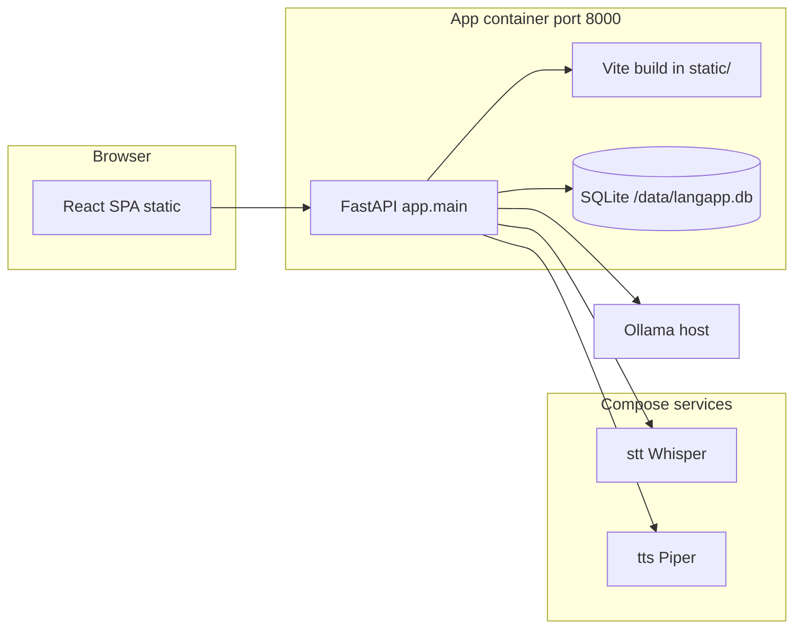

# LangApp — master repository map

Use this file first when orienting in the codebase. It describes layout, runtime boundaries, and where to change behavior.

## What this project is

**LangApp** is a local-first language lab: a **FastAPI** backend (with optional **SQLite**), a **Vite + React** SPA, and **Docker**-orchestrated **STT** (Whisper) and **TTS** (Piper) services. The app talks to **Ollama** on the host (or another URL) for LLM chat, exercises, glosses, and vocabulary packs.

## Architecture (data flow)

- **Production-style run**: SPA is built into `backend/static` inside the image; FastAPI serves API under `/api/*` and the SPA from `/` ([`Dockerfile.app`](Dockerfile.app)).
- **Local dev**: run Vite (`frontend`, port 5173) and uvicorn (`backend`, port 8000); Vite proxies `/api`, `/swagger`, `/redoc`, `/openapi.json` to `http://127.0.0.1:8000` ([`frontend/vite.config.ts`](frontend/vite.config.ts)).

## Top-level layout

| Path | Role |
|------|------|
| [`backend/app/`](backend/app/) | Main Python application package (`import app...`). |
| [`frontend/`](frontend/) | React UI source; `npm run build` output is copied into the app image. |
| [`services/stt/`](services/stt/) | Whisper STT microservice (Docker). |
| [`services/tts/`](services/tts/) | Piper TTS microservice (Docker). |
| [`docker-compose.yml`](docker-compose.yml) | App + stt + tts + volumes; env from `.env`. |
| [`Dockerfile.app`](Dockerfile.app) | Multi-stage: build frontend, run uvicorn + static. |
| [`.env.example`](.env.example) | Documented env vars (copy to `.env`). |
| [`.cursor/rules/`](.cursor/rules/) | Cursor agent rules (coverage, navigation). |
| [`.github/workflows/`](.github/workflows/) | CI: PR coverage (Cobertura + summary), push lint (Ruff + `tsc`). |
| [`README.md`](README.md) | Build, run, and test procedures. |

## Backend (`backend/app/`)

| Area | Path | Notes |
|------|------|------|
| Entry | [`main.py`](backend/app/main.py) | FastAPI app, CORS, router includes, `/api/settings/public`, static mount, lifespan → `init_db`. |
| Config | [`config.py`](backend/app/config.py) | Pydantic settings from env: Ollama, STT/TTS URLs, `LANG_*`, `CEFR_LEVEL`, models, `API_KEY`, `lang_target_locale` helper. |
| DB | [`db.py`](backend/app/db.py), [`models.py`](backend/app/models.py) | SQLAlchemy engine/session; `Deck`, `Card`, `GlossCache`, `ConversationTurn`, `ExerciseAttempt`. SQLite migration hook for schema tweaks. |
| Auth | [`deps.py`](backend/app/deps.py) | Optional `X-API-Key` when `API_KEY` is set. |
| SRS | [`srs/sm2.py`](backend/app/srs/sm2.py) | SM-2 scheduling. |
| LLM | [`services/ollama.py`](backend/app/services/ollama.py) | Chat complete/stream, JSON generation, `tutor_system_prompt`, `resolve_model`, vocab/gloss prompts. |
| Speech clients | [`services/speech.py`](backend/app/services/speech.py) | Calls STT/TTS HTTP APIs. |

### Routers (`backend/app/routers/`)

| Router | Prefix | Purpose |
|--------|--------|---------|
| [`chat.py`](backend/app/routers/chat.py) | `/api/chat` | SSE stream + complete. |
| [`speech.py`](backend/app/routers/speech.py) | `/api/speech` | TTS proxy, transcribe proxy, voice-turn pipeline. |
| [`srs.py`](backend/app/routers/srs.py) | `/api/srs` | Decks, cards CRUD, due queue, learn queue, review, intro completion. |
| [`lexicon.py`](backend/app/routers/lexicon.py) | `/api/lexicon` | Word gloss (cache + Ollama + deck match). |
| [`vocab.py`](backend/app/routers/vocab.py) | `/api/vocab` | LLM pack generation, MCQ, production grading. |
| [`exercises.py`](backend/app/routers/exercises.py) | `/api/exercises` | Generate + grade written exercises. |
| [`pronunciation.py`](backend/app/routers/pronunciation.py) | `/api/pronunciation` | Target phrase / shadowing analysis. |

## Frontend (`frontend/src/`)

| Path | Role |
|------|------|
| [`main.tsx`](frontend/src/main.tsx), [`App.tsx`](frontend/src/App.tsx) | React bootstrap, routes. |
| [`components/Layout.tsx`](frontend/src/components/Layout.tsx) | Shell nav + `SettingsProvider`. |
| [`context/SettingsContext.tsx`](frontend/src/context/SettingsContext.tsx) | Fetches `/api/settings/public` once. |
| [`api.ts`](frontend/src/api.ts) | `fetch` helpers, auth header, chat stream, voice, gloss, vocab APIs. |
| [`components/TargetLangText.tsx`](frontend/src/components/TargetLangText.tsx) | Segmented L2 text + hover/long-press gloss tooltips. |
| [`pages/`](frontend/src/pages/) | `ChatPage`, `VoicePage`, `SrsPage`, `ExercisePage`, `PronouncePage`. |

Routes: `/` chat, `/voice`, `/srs`, `/exercises`, `/pronounce`.

## Auxiliary Python (not under `app/`)

- [`services/stt/app.py`](services/stt/app.py) — STT container app.
- [`services/tts/app.py`](services/tts/app.py) — TTS container app.

## Configuration & secrets

- **Environment**: see [`.env.example`](.env.example). Key vars: `OLLAMA_HOST`, `LLM_MODEL*`, `LANG_TARGET`, `LANG_UI`, `CEFR_LEVEL`, `STT_URL`, `TTS_URL`, `API_KEY`, optional `LANG_TARGET_LOCALE`.
- **Database**: Docker uses `DATABASE_URL=sqlite:////data/langapp.db` on a volume; local dev often `sqlite:///./langapp.db` under `backend/`.

## Where to implement common tasks

| Task | Where to look |
|------|----------------|
| New REST surface | New or existing file in `backend/app/routers/`, register in `main.py`. |
| New table / column | `models.py` + `db.py` migration block if SQLite ALTER needed. |
| Tutor / LLM behavior | `services/ollama.py` + router that calls it. |
| New UI screen | `frontend/src/pages/`, route in `App.tsx`, link in `Layout.tsx`. |
| Cross-page L2 glosses | `TargetLangText` + `/api/lexicon/gloss`. |
| Docker wiring | `docker-compose.yml`, `Dockerfile.app`, service Dockerfiles under `services/*`. |

## Tests & quality gates

- **Commands** (install, build, run, test): [README.md](README.md). GitHub Actions: [`.github/workflows/lint.yml`](.github/workflows/lint.yml) on push; [`.github/workflows/coverage-pr.yml`](.github/workflows/coverage-pr.yml) on pull requests (merged Cobertura + [chkltlabs/CodeCoverageSummary](https://github.com/chkltlabs/CodeCoverageSummary)).
- Backend/frontend test and coverage expectations: [`.cursor/rules/test-coverage.mdc`](.cursor/rules/test-coverage.mdc).
- When you **restructure** directories or add major services, **update this file** in the same change.

## Plans & history

- Product/architecture notes may appear under [`.cursor/plans/`](.cursor/plans/) (not loaded by the runtime).
